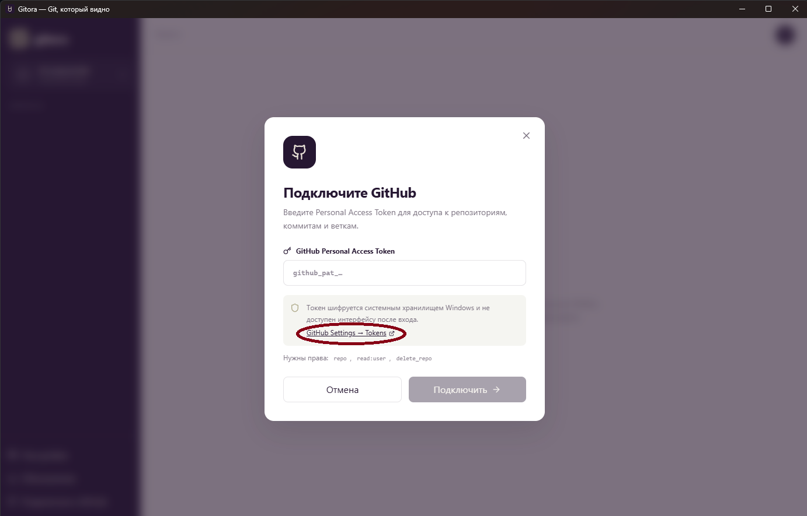
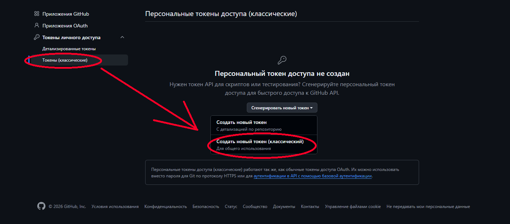
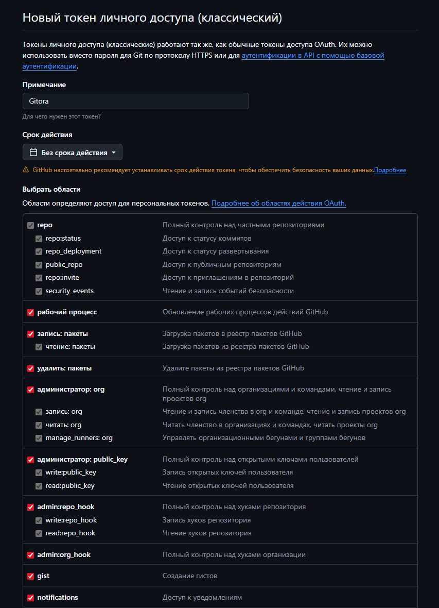
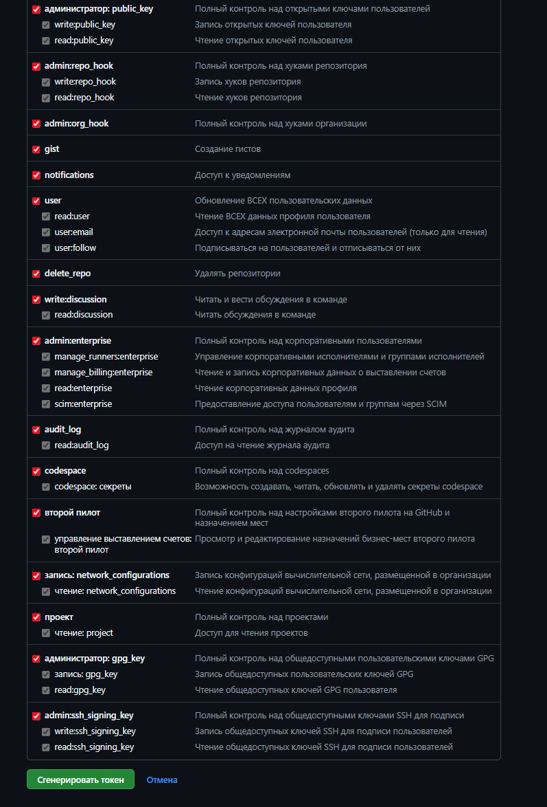
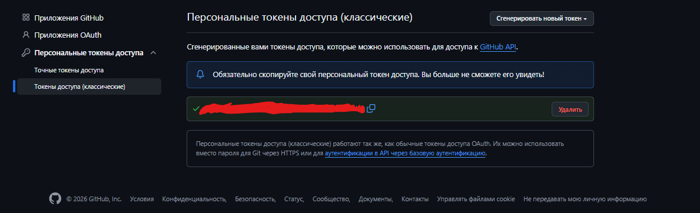
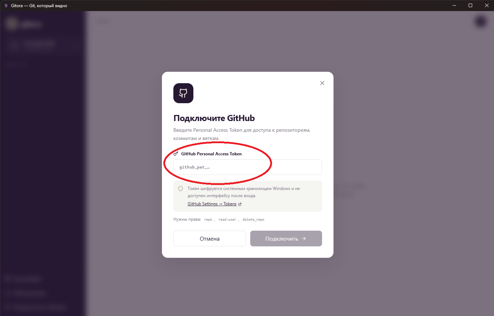
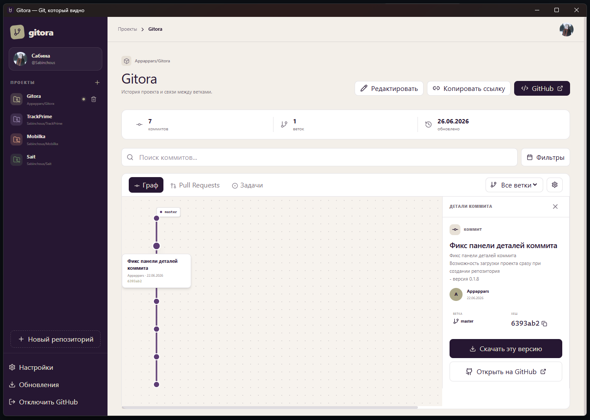
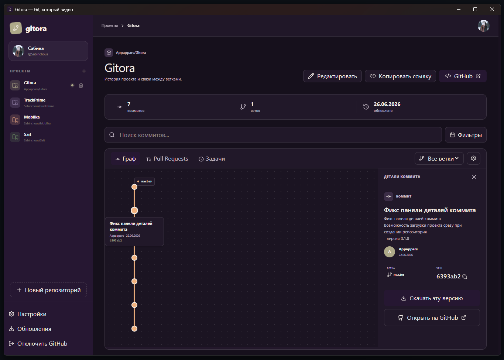

# Gitora

**Git, который видно** — десктопное приложение для визуального просмотра истории Git-репозиториев.

## Навигация

- [Возможности](#возможности)
- [Быстрый старт](#быстрый-старт)
  - [Скачать приложение](#1-скачать-приложение)
  - [Подключить GitHub через Personal Access Token](#2-подключить-github-через-personal-access-token)
- [Использование](#использование)
- [MCP-сервер для ИИ-агентов](#mcp-сервер-для-ии-агентов)
  - [Установка](#установка)
  - [Инструменты MCP](#инструменты-mcp)
  - [Примеры использования в Claude](#примеры-использования-в-claude)
- [Разработка](#разработка)
  - [Технологии](#технологии)
  - [Запуск в режиме разработки](#запуск-в-режиме-разработки)
  - [Сборка](#сборка)
- [Структура проекта](#структура-проекта)
- [Лицензия](#лицензия)

## Возможности

- Визуальный граф коммитов с отображением веток и слияний
- Просмотр деталей каждого коммита (автор, дата, изменения)
- Фильтрация по веткам
- Создание новых репозиториев прямо из приложения
- Интеграция с GitHub API
- MCP-сервер для работы с ИИ-агентами (Claude и др.)

## Быстрый старт

### 1. Скачать приложение

Скачайте `Gitora Setup 0.1.10.exe` из папки `outputs/release/` или загрузите с [GitHub Releases](https://github.com/Appappars/Gitora/releases).

Запустите установщик и следуйте инструкциям.

### 2. Подключить GitHub через Personal Access Token

После установки Gitora попросит подключить GitHub. Для этого нужен **Personal Access Token** — ключ доступа, который позволяет приложению читать ваши репозитории, показывать коммиты, работать с ветками и выполнять действия от вашего имени.

На стартовом экране нажмите ссылку **GitHub Settings → Tokens**. Она откроет страницу настроек GitHub, где можно создать новый ключ доступа.



В настройках GitHub откройте раздел **Tokens (classic)** и нажмите **Generate new token → Generate new token (classic)**. Классический токен нужен для более гибкой настройки прав доступа.



На странице создания токена:

1. В поле **Note** укажите понятное название, например `Gitora`.
2. В блоке **Expiration** выберите срок действия. Если вам не принципиально ограничивать срок, можно выбрать **No expiration**.
3. В блоке **Scopes** отметьте нужные разрешения.

Для полного доступа ко всем возможностям Gitora можно отметить все галочки. Так приложение сможет взаимодействовать с GitHub без ограничений: читать репозитории, получать историю коммитов, работать с ветками, создавать и удалять репозитории, открывать данные профиля и выполнять другие действия, если они понадобятся.

Минимальный набор прав для базовой работы:

| Разрешение | Для чего нужно |
|------------|----------------|
| `repo` | Доступ к публичным и приватным репозиториям |
| `read:user` | Чтение данных профиля GitHub |
| `delete_repo` | Удаление репозиториев из приложения, если вы используете эту функцию |





После настройки нажмите **Generate token**.

> **Важно:** GitHub покажет токен только один раз. Сразу скопируйте его и не публикуйте в открытом доступе.



Вернитесь в Gitora, вставьте скопированный токен в поле **GitHub Personal Access Token** и нажмите **Подключить**.



После подключения Gitora загрузит ваши репозитории GitHub. Вы сможете просматривать историю проекта, коммиты, ветки, pull requests и задачи, а также открывать репозиторий на GitHub или копировать ссылку на него.

Gitora поддерживает светлую и тёмную тему:





## Использование

1. **Выберите репозиторий** — в боковой панели слева
2. **Просматривайте граф** — коммиты отображаются с учётом веток и слияний
3. **Кликните на коммит** — справа откроются детали (автор, хеш, сообщение)
4. **Фильтруйте по веткам** — используйте выпадающий список над графом
5. **Создайте репозиторий** — нажмите "+" в боковой панели

## MCP-сервер (для ИИ-агентов)

Gitora включает MCP-сервер, который позволяет ИИ-агентам (Claude, Cursor и др.) работать с вашими GitHub-данными.

### Установка

1. Убедитесь, что Gitora установлена и вы залогинены
2. Добавьте конфигурацию MCP в Claude Desktop:

Файл: `%APPDATA%\Claude\claude_desktop_config.json`

```json
{
  "mcpServers": {
    "gitora": {
      "command": "node",
      "args": ["C:\\Users\\<ваше_имя>\\Desktop\\Gitora\\mcp-server.cjs"]
    }
  }
}
```

3. Перезапустите Claude Desktop

### Инструменты MCP

| Инструмент | Описание |
|------------|----------|
| `list_repos` | Список репозиториев пользователя |
| `get_commits` | История коммитов репозитория |
| `get_branches` | Список веток репозитория |
| `get_commit_detail` | Детали коммита со списком изменённых файлов |
| `search_commits` | Поиск коммитов по сообщению или автору |

### Примеры использования в Claude

- "Покажи мои репозитории на GitHub"
- "Какие коммиты были в repo/name за последнюю неделю?"
- "Найди коммиты от пользователя john"
- "Что изменилось в коммите abc1234?"

## Разработка

### Технологии

- **Frontend:** React 19 + TypeScript + Tailwind CSS
- **Desktop:** Electron 42
- **Сборка:** Vite + electron-builder
- **MCP:** @modelcontextprotocol/sdk

### Запуск в режиме разработки

```bash
# Установка зависимостей
npm install

# Запуск dev-сервера (только веб)
npm run dev

# Запуск Electron + dev-сервер
npm run electron:dev
```

### Сборка

```bash
# Сборка веб-версии
npm run build

# Сборка Electron exe
npm run electron:build
```

## Структура проекта

```
gitora/
├── electron/           # Electron main process
│   ├── main.cjs       # Главный процесс
│   └── preload.cjs    # Preload скрипт
├── src/
│   ├── components/     # React компоненты
│   │   ├── Graph/      # Граф коммитов
│   │   ├── DetailPanel/# Панель деталей
│   │   ├── Sidebar/    # Боковая панель
│   │   └── Modal/      # Модальные окна
│   ├── context/        # React Context
│   ├── lib/            # Алгоритмы (graphLayout)
│   ├── types/          # TypeScript типы
│   └── styles/         # CSS стили
├── mcp-server.cjs      # MCP-сервер для ИИ
├── mcp-config.json     # Конфигурация MCP
└── package.json
```
Разработано совместно Sabinchous и Appappars

## Лицензия

MIT
